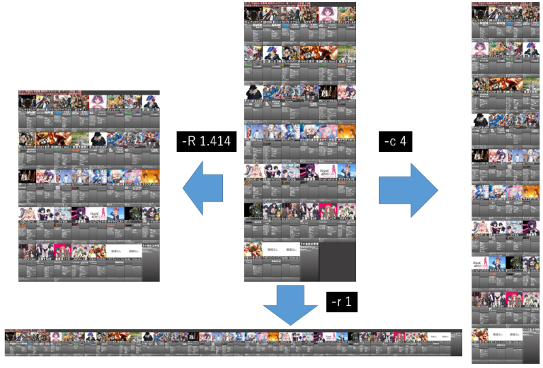

# うずらインフォ・リパッチャー

うずらインフォから提供されるTVアニメ一覧の画像は横6列に固定されていますが、
このツールで任意の列に変換できます。

私は一覧画像をA3用紙に印刷して掲示する際、
用紙いっぱいに印刷されるようにいつも画像を編集していました。
その作業を削減するためこのようなツールを開発しました。

## 使い方

```
java -jar uzurainfo-repatcher.jar <source-image> [-o <target-image>] option
```

`-o`による出力ファイル名の指定がない場合、`a.png`がカレントディレクトリに出力されます。

出力ファイルのフォーマットは出力ファイル名の拡張子から自動的に判断されます。
自動的に判断できない場合は、pngが選択されます。

以下の引数付きオプションでアニメ画像の並べ方を指定します。
必ずオプションを1つ指定する必要があります。

- `-R,--ratio <ratio>` : 横幅を1としたときの縦幅の比率を指定します。縦長の用紙に入るように並べるには `-R 1.414`
- `-c,--column <column-num>` : 横に何個のアニメ画像を並べるかを4以上で指定します。横に4個並べるには `-c 4`
- `-r,--row <row-num>` : 縦に何個のアニメ画像を並べるかを1以上で指定します。縦に1個並べるには `-r 1`



## ライセンス

You just DO WHAT THE FUCK YOU WANT TO.
